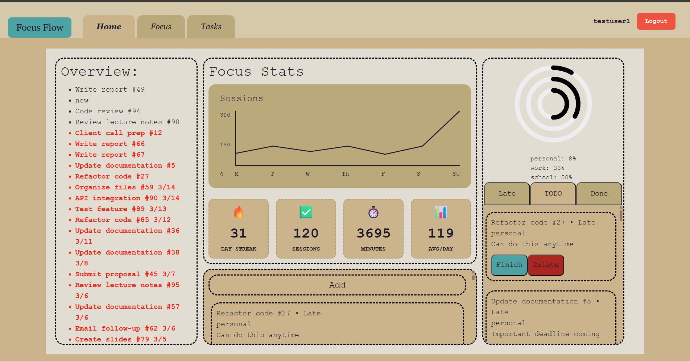

# FocusFlow


A Pomodoro timer and task management application that helps you stay focused, build streaks, and track productivity. Built with React, Node, Express, and MongoDB.

## Authors

- **Nishant Naravarajula** — Sessions, Authentication, Timer
- **Avijit Singh (Vee)** — Tasks, Calendar, Dashboard

## Class

[CS5610 — Web Development](https://johnguerra.co/classes/webDevelopment_online_spring_2026/) · Northeastern University · Spring 2026

## Live Demo

- **App:** https://focusflow-1-pnq8.onrender.com
- **Video:** https://youtu.be/CAk_hpplzfA

## Project Objective

FocusFlow helps users manage their time and tasks using the Pomodoro technique. Users can:

- Start timed focus sessions (work / break) with customizable duration
- Track session history, streaks, and weekly productivity stats
- Manage tasks with deadlines, types, and filters (Late / To-do / Done)
- Visualize progress with rings and weekly line charts

## Screenshot



## Tech Stack

- **Frontend:** React 19, React Router 7, Vite
- **Backend:** Node.js, Express 5, Passport (JWT)
- **Database:** MongoDB (native driver)
- **Auth:** JWT + bcryptjs
- **Typography:** Inter (body) + Poppins (display), served via Google Fonts

## Features

- User registration and login
- Pomodoro timer with work / break modes and duration dropdown
- Per-session labels and audible completion chime
- Session history with pagination and delete confirmation
- Weekly sessions graph and streak / stats tracking
- Task CRUD with character limits, due dates, types, and status filters
- Delete-confirmation dialogs (no accidental destructive actions)
- Fully keyboard accessible with visible focus rings and skip-to-content link
- Responsive layout — desktop (3-column) and mobile (stacked)

---

## P4 — Design, Accessibility, and Usability Improvements

This iteration adds a formal design system, full accessibility coverage, and code-level fixes driven by a **6-participant usability study** (3 participants per team member).

### Design system

All styles are driven by a centralized token file at `client/src/styles/design-tokens.css`. This enforces consistency across every component without hardcoded values.

- **Color palette** — a single source of truth with semantic tokens:
  - `--color-success` (approval / confirm — same green on every approve action)
  - `--color-danger` (cancel / delete / destructive — same red everywhere)
  - `--color-warning` (late / paused — same amber everywhere)
  - `--color-accent-*` (brand forest green, 5 shades)
  - Neutral surface + text tokens (no hardcoded hex values in any component)
- **Typography pairing** — Poppins (display) + Inter (body), loaded from Google Fonts with `font-display: swap`. All headings use a defined modular scale.
- **Spacing** — every padding and margin is a token on an 8-px grid (`--space-1` through `--space-16`).
- **Radii, shadows, motion** — tokenized and reused across components.

### Accessibility

- Semantic HTML throughout: `<nav>`, `<main>`, `<section>`, `<article>`, `<header>`, `<ul>`/`<li>`, proper heading order with single `<h1>`.
- **Skip-to-main-content link** (visible on keyboard focus).
- `aria-label`, `aria-labelledby`, `aria-describedby`, `aria-current`, `aria-live` applied where appropriate.
- Modals use `role="dialog"` + `aria-modal="true"` + focus trap + initial focus + Esc-to-close.
- Timer display has `role="timer"` + `aria-live="polite"` so screen readers can announce countdown changes.
- Decorative icons use `aria-hidden="true"`; interactive icons have descriptive `aria-label`s.
- Color contrast passes WCAG AA (verified via Lighthouse — 96+ score on all pages).
- Respects `prefers-reduced-motion` (animations disabled for users who request it).
- Full keyboard operation — Tab / Shift-Tab / Enter / Space / Esc all covered.

### Usability study → code changes

Six participants (3 per team member) ran through scripted user stories. Findings were prioritized Must / Should / Could, and mapped directly to code changes:

| Finding | Priority | Implementation |
|---|---|---|
| Character limit on all text fields | Must | `maxLength` on every input (email 100, password 72, task name 60, task desc 200, timer label 50, username 30) |
| Dropdown for timer duration (text field was error-prone) | Must | `<select>` with presets [5, 10, 15, 20, 25, 30, 45, 60] |
| Font / typography consistency | Must | All fonts unified to Inter + Poppins; system fonts removed |
| Delete confirmation (prevent misclicks) | Must | New reusable `ConfirmDialog` component wired to task and session delete actions |
| No accidental modal exit (backdrop click closed the modal) | Must | Backdrop click disabled — modal only closes via Esc / Cancel / × button |
| Session list overflow | Must | Contained scroll with `overflow-y: auto` + flex layout so list scrolls inside its card |
| Whole nav element clickable | Should | `.nav-link` uses `display: block` + padding so the full pill is a hit target |
| Clearer labels on confusing sections | Should | Added aria-labels, section headings ("Upcoming", "Focus stats", "This week's tasks") |
| More vibrant colors | Should | Accent green saturated from muted to vibrant `#16a34a` / `#22c55e` |

### Code quality

- Prettier formats every file (`.prettierrc` at root).
- ESLint configs in both `client/` and `server/`; both pass without errors.
- No hardcoded backend URLs — the client reads `VITE_API_URL` from `.env.development` / `.env.production`.
- Each React component has `PropTypes`; no deprecated `defaultProps` on function components.

---

## Installation

### Prerequisites

- Node.js 18+
- MongoDB Atlas account or local MongoDB instance

### Clone the repository

```bash
git clone https://github.com/nish-naravarajula/FocusFlow.git
cd FocusFlow
```

### Backend setup

```bash
cd server
npm install
```

Create a `.env` file in the `server/` folder:

```
MONGO_URI=your_mongodb_connection_string
JWT_SECRET=your_jwt_secret_key
PORT=5000
```

Start the server:

```bash
npm run dev
```

(Optional) seed the database with ~1,100 synthetic records:

```bash
npm run seed
```

### Frontend setup

```bash
cd client
npm install
```

Create `client/.env.development`:

```
VITE_API_URL=http://localhost:5000
```

Create `client/.env.production`:

```
VITE_API_URL=<your deployed backend URL>
```

Then run:

```bash
npm run dev
```

The app will be available at `http://localhost:5173`.

### Test credentials (if you ran the seed script)

```
Email: testuser1@example.com
Password: password123
```

---

## Project Structure

```
FocusFlow/
├── client/                         # React frontend (Vite)
│   ├── public/                     # favicon and static assets
│   ├── src/
│   │   ├── api/                    # centralized API client
│   │   ├── components/
│   │   │   ├── Auth/               # Login, Register, shared auth.css
│   │   │   ├── Circle/             # ProgressCircles
│   │   │   ├── ConfirmDialog/      # reusable confirmation modal
│   │   │   ├── Nav/                # NavBar, NavItem
│   │   │   ├── Sessions/           # SessionsGraph, SessionHistory, StreakDisplay
│   │   │   ├── Tasks/              # TaskItem, TaskList, TaskNav, CreateTask
│   │   │   └── Timer/              # Timer
│   │   ├── pages/                  # Home, Focus, Tasks
│   │   ├── styles/
│   │   │   └── design-tokens.css   # single source of truth for colors, type, spacing
│   │   ├── App.jsx
│   │   └── main.jsx
│   ├── eslint.config.js
│   ├── vite.config.js
│   └── package.json
├── server/                         # Express backend
│   ├── config/                     # Passport config
│   ├── db/                         # MongoDB connection
│   ├── middleware/                 # JWT auth middleware
│   ├── routes/                     # auth, sessions, tasks
│   ├── seed/                       # synthetic data generator
│   ├── index.js
│   ├── eslint.config.js
│   └── package.json
├── .gitignore
├── .prettierrc
├── LICENSE
└── README.md
```

## API Endpoints

### Auth
- `POST /api/auth/register` — Register new user
- `POST /api/auth/login` — Login user
- `GET /api/auth/me` — Get current user

### Sessions
- `GET /api/sessions` — Paginated user sessions
- `GET /api/sessions/stats` — Streaks and aggregate stats
- `POST /api/sessions` — Create a session
- `PUT /api/sessions/:id` — Update a session
- `DELETE /api/sessions/:id` — Delete a session

### Tasks
- `GET /api/tasks` — Paginated user tasks
- `POST /api/tasks` — Create a task
- `PUT /api/tasks/:id` — Update a task
- `DELETE /api/tasks/:id` — Delete a task

## Accessibility testing

Run Lighthouse against the live site (or `http://localhost:5173` after `npm run dev`):

1. Open Chrome DevTools (F12)
2. Lighthouse tab → Accessibility category → Desktop → Analyze page load
3. Expected score: **95+** on every page

## License

This project is licensed under the MIT License — see the [LICENSE](LICENSE) file for details.